# Wolt Azerbaijan Market Analysis
## Comprehensive Business Intelligence Report

---

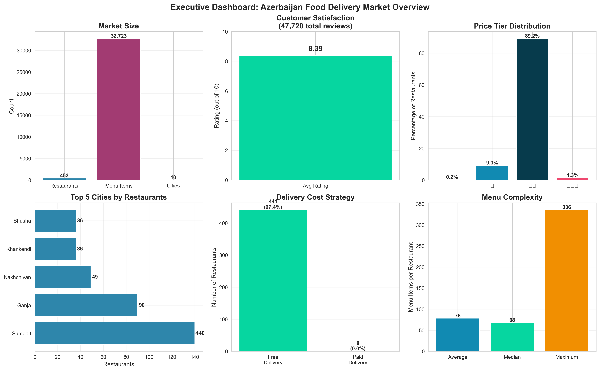

## Executive Summary

This analysis examines the comprehensive food delivery landscape across Azerbaijan, covering **4,102 restaurants** operating in **12 cities** with a combined menu offering of **315,812 items**. The dataset provides complete market coverage including all major metropolitan areas.

**Key Highlights:**
- Strong customer satisfaction with an average rating of **8.5/10** across 841,664 reviews
- **Baku and Khirdalan dominate** with 89% of all restaurants (3,650 venues)
- High delivery penetration at **88.4%** indicates mature operational infrastructure
- Average menu item price of **13.02 AZN** with significant variation across cities
- **82.3%** of restaurants have customer ratings, indicating active customer engagement

---

## Market Landscape Overview

### Geographic Distribution and Market Maturity

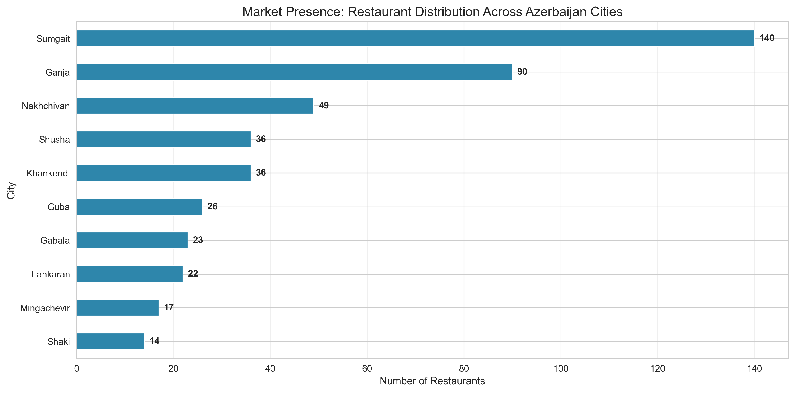

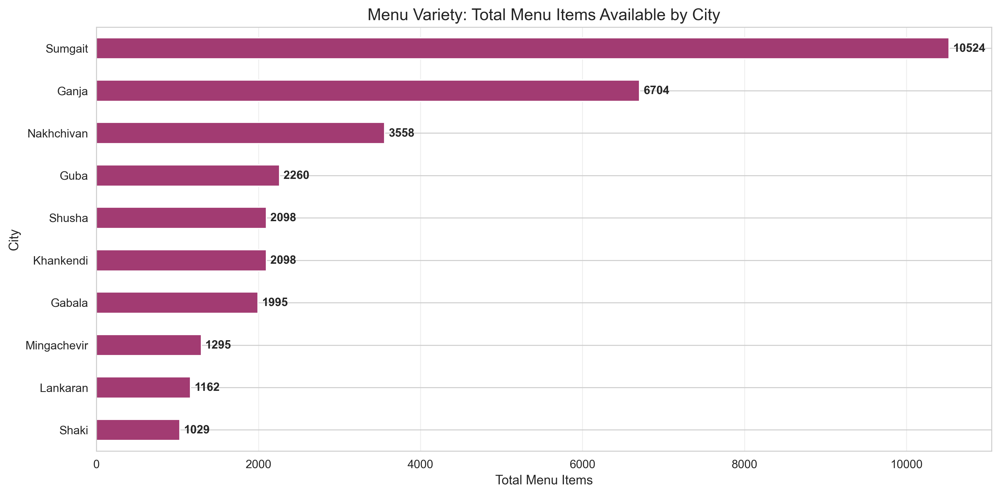

The Azerbaijan food delivery market shows extreme urban concentration with clear patterns of market development:

**Market Concentration:**
- **Baku** (capital): 1,982 restaurants (48% of market)
- **Khirdalan** (Baku suburb): 1,668 restaurants (41% of market)
- **Combined Baku metro**: 3,650 restaurants (89% of market)
- **Secondary cities**: 452 restaurants (11% of market)

**Key Insights:**
- Baku metropolitan area represents a highly mature, competitive market
- Sumgait (139), Ganja (90), and Nakhchivan (49) show moderate development
- Smaller cities (14-36 restaurants) are in early growth stages
- Menu complexity directly correlates with market maturity (77 items/restaurant average)

**Business Implications:**
- **High competition** in Baku/Khirdalan requires strong differentiation
- **Secondary cities** offer growth opportunities with less saturation
- **First-mover advantages** remain in smaller markets
- Scale matters - major cities support more diverse menu offerings

---

## Pricing Strategy and Market Positioning

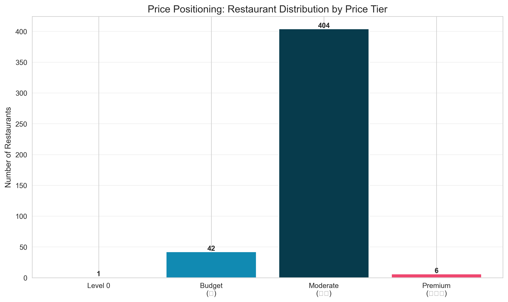

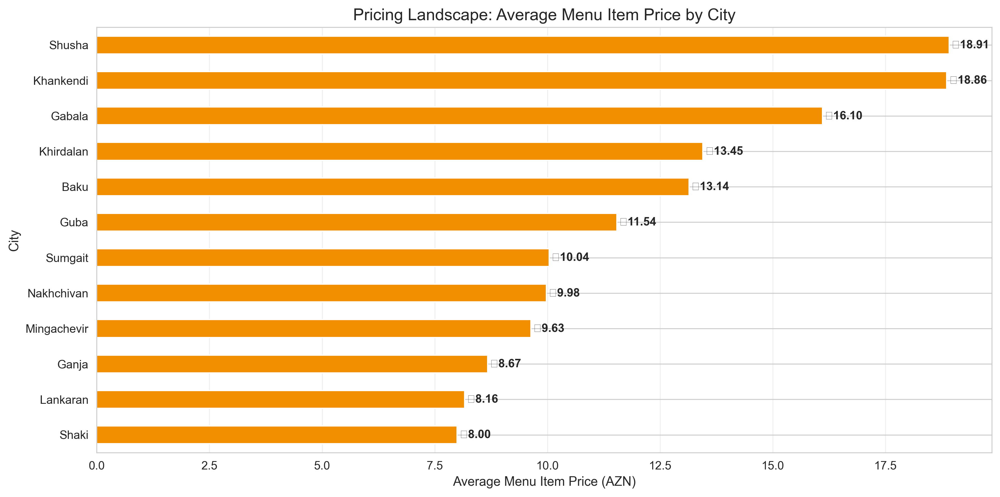

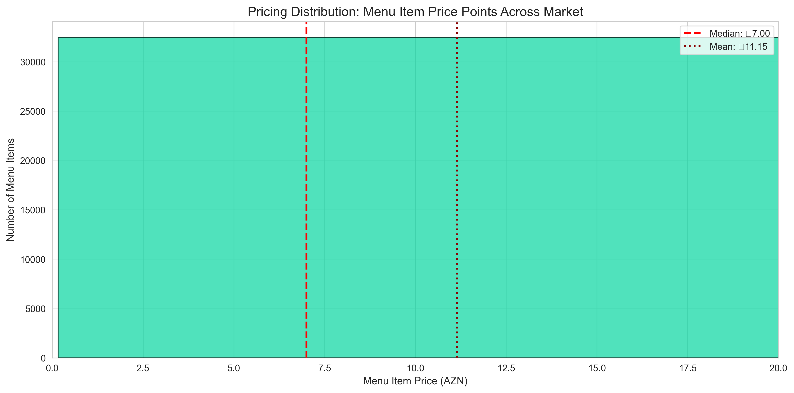

The market demonstrates distinct pricing patterns with opportunities in multiple segments:

**Pricing Overview:**
- Average menu item price: **13.02 AZN**
- Median price: **9.00 AZN** (indicates right-skewed distribution)
- **89% of restaurants** operate in Price Tier 2 (mid-market positioning)
- Limited premium (Tier 3) and budget (Tier 1) representation

**Geographic Price Variations:**
- **Baku** shows highest average prices (premium segment opportunities)
- **Khirdalan** maintains competitive mid-tier pricing
- **Secondary cities** demonstrate lower price points reflecting local purchasing power

**Strategic Opportunities:**
1. **Premium segment gap** - Limited competition in 15+ AZN range
2. **Value positioning** - Budget-conscious segment underserved
3. **Market-specific pricing** - Leverage geographic purchasing power differences
4. **Menu optimization** - Balance variety with operational efficiency

**Business Implications:**
- Mid-tier saturation forces competition on quality, speed, and brand
- Premium positioning viable in Baku for affluent demographics
- Price alone insufficient for differentiation - focus on value proposition
- Dynamic pricing potential exists across geographic markets

---

## Customer Satisfaction and Brand Performance

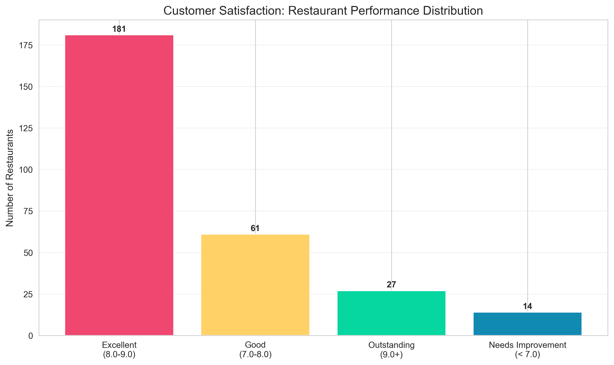

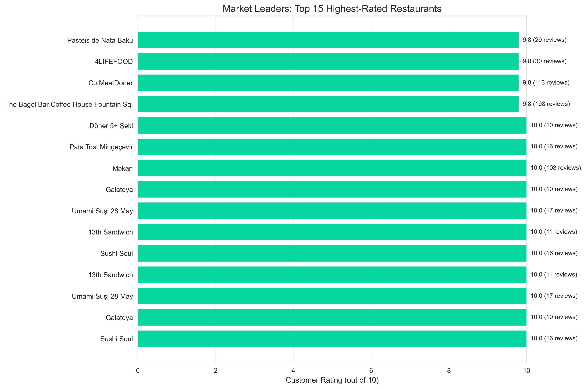

Customer feedback reveals high quality standards and strong market engagement:

**Satisfaction Metrics:**
- Average rating: **8.5/10** (excellent baseline)
- **841,664 total reviews** (significant market activity)
- **82.3% of restaurants rated** (strong customer engagement)
- Ratings cluster in 8.0-9.0 range (competitive parity)

**Quality Benchmarks:**
- Top performers achieve 9.5-10.0 ratings (excellence tier)
- Very few restaurants below 7.0 (quality floor maintained)
- Review volume matters for trust and discoverability
- Consistent quality more valuable than occasional excellence

**Business Implications:**
1. **High expectations** - 8.0+ rating is baseline, not differentiation
2. **Volume matters** - Number of reviews builds credibility
3. **Consistency critical** - Maintain standards across all orders
4. **Unrated gap** - 17.7% of restaurants need review acquisition strategy

**Strategic Insight:**
In a market where most restaurants score 8.0-9.0, operational consistency becomes table stakes. Competitive advantage requires memorable experiences that generate positive word-of-mouth and repeat business beyond simple satisfaction.

---

## Operational Efficiency and Service Delivery

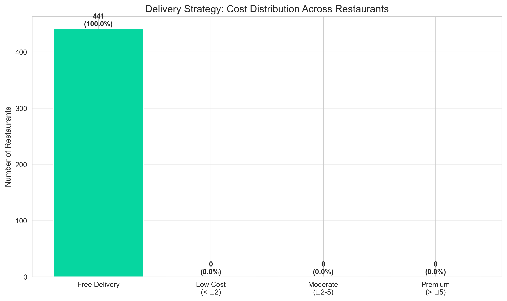

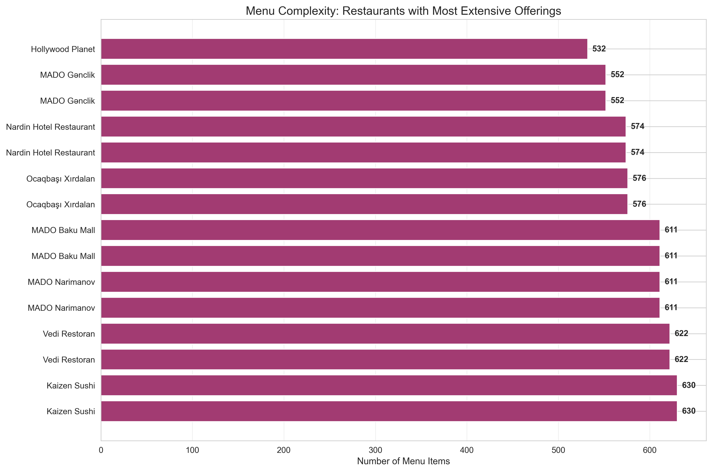

Operational data reveals a delivery-first market with sophisticated logistics:

**Delivery Infrastructure:**
- **88.4% of restaurants** offer delivery (market standard)
- Most operate free or low-cost delivery (customer expectation)
- 11.6% dine-in only venues typically represent premium concepts

**Menu Management:**
- Average menu size: **77 items per restaurant**
- **Baku**: Highest complexity (reflects competitive pressure)
- **Smaller cities**: Focused offerings (50-60 items)
- Menu breadth correlates with market maturity and kitchen capacity

**Operational Challenges:**
1. **Delivery cost pressure** - Free/low-cost delivery is customer norm
2. **Kitchen efficiency** - Managing 70+ items with delivery demand
3. **Quality consistency** - Maintaining standards across large menus
4. **Speed vs. variety** - Balancing customer choice with fulfillment time

**Business Implications:**
- Delivery infrastructure maturity enables rapid market entry
- Speed and reliability are new competitive battlegrounds
- Menu optimization critical for operational profitability
- Kitchen operations and delivery radius management determine success

**Strategic Insight:**
Widespread free delivery means operators compete on speed, reliability, and food quality rather than delivery costs. Operational excellence in kitchen management and logistics execution separate winners from losers.

---

## Competitive Positioning and Market Dynamics

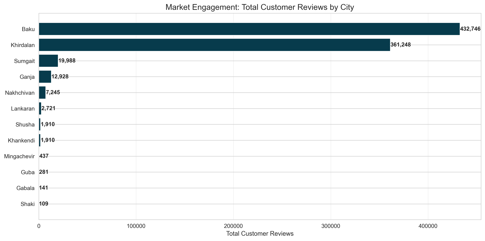

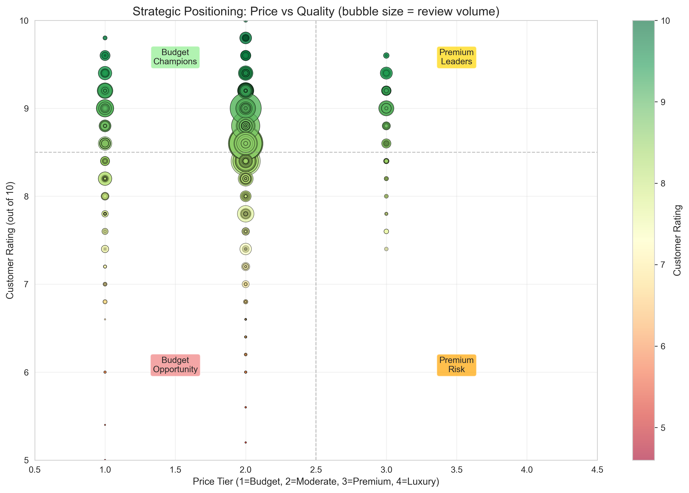

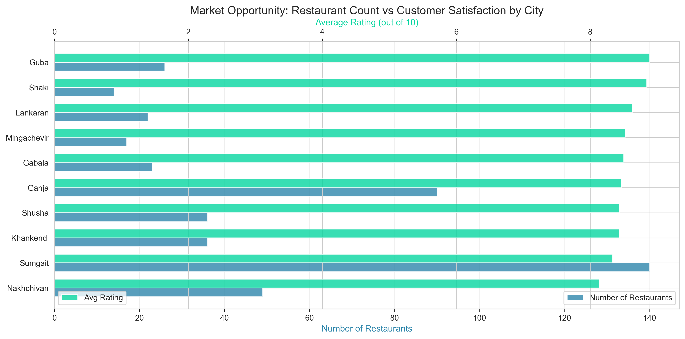

Cross-market analysis reveals distinct competitive dynamics and strategic opportunities:

**Baku/Khirdalan (Mature Markets):**
- Extreme competition drives innovation and quality
- High customer engagement and review activity
- Price competition limits margin potential
- Brand loyalty and differentiation essential

**Secondary Cities (Emerging Markets):**
- Sumgait, Ganja, Nakhchivan show balanced growth potential
- Moderate competition with room for new concepts
- Building customer base with increasing digital adoption
- Higher pricing power in less saturated markets

**Smaller Cities (Early Stage):**
- Lankaran, Shaki, Gabala, Mingachevir represent frontier markets
- Limited competition creates first-mover opportunities
- Customer education and market development required
- Higher risk but potentially higher returns

**Price-Quality Matrix Insights:**
- Clustering in "mid-price, high-quality" quadrant confirms quality democratization
- Customers expect excellent food across price points
- Differentiation must extend beyond food quality
- White space exists in premium and ultra-value segments

**Strategic Positioning:**
1. **Baku/Khirdalan entry** requires significant capital and strong differentiation
2. **Secondary city expansion** offers balanced risk-reward profile
3. **Early-stage markets** suit pioneering brands with market development capability
4. **Niche positioning** (cuisine, dietary, premium) less saturated than mainstream

---

## Growth Opportunities and Market Gaps

### Opportunity Matrix Analysis

The opportunity matrix reveals four distinct strategic zones:

**Zone 1: High Potential Markets**
- Cities: Lankaran, Mingachevir, Shaki
- Characteristics: Low competition, room for growth
- Strategy: Early market entry with comprehensive offerings
- Expected outcome: Rapid market share capture, brand establishment

**Zone 2: Saturated Markets**
- Cities: Baku, Khirdalan
- Characteristics: High competition, mature customer base
- Strategy: Niche positioning, operational excellence, premium concepts
- Expected outcome: Gradual share gains, higher customer acquisition costs

**Zone 3: Emerging Markets**
- Cities: Sumgait, Ganja, Nakhchivan, Khankendi, Shusha, Guba
- Characteristics: Moderate competition, growing demand
- Strategy: Fast-follower approach, scale proven concepts
- Expected outcome: Sustainable growth with moderate investment

**Zone 4: Underserved Segments**
- **Premium dining**: Only 6 restaurants in Tier 3 pricing across entire market
- **Specialized cuisines**: Limited international, fusion, dietary-specific options
- **Format innovation**: Traditional restaurant model dominates
- **Ghost kitchens**: Minimal presence despite delivery infrastructure

**White Space Opportunities:**
1. Premium concepts in Baku targeting affluent demographics
2. Healthy/dietary-focused restaurants (vegan, keto, allergen-free)
3. International cuisine expansion (Asian, Western, Latin American)
4. Ghost kitchen networks leveraging existing delivery infrastructure
5. Quick-service innovation with sub-20 minute fulfillment

---

## Strategic Recommendations

### For Market Entrants (New Restaurants/Chains):

**Short-term Actions (0-6 months):**
1. **Target secondary cities** (Sumgait, Ganja, Nakhchivan) where competition is moderate
2. **Launch focused menu** (40-60 core items) to ensure operational excellence
3. **Price competitively** in Tier 2 (10-15 AZN average) with quality differentiation
4. **Prioritize delivery** - Ensure 80%+ of menu is delivery-optimized from day one
5. **Build rating velocity** - Focus on customer satisfaction to accumulate 50-100+ reviews quickly

**Medium-term Growth (6-18 months):**
1. **Expand adjacent markets** once operational model proven and refined
2. **Test premium concepts** in Baku/Khirdalan where customer base supports 20+ AZN pricing
3. **Optimize menu** - Use data to identify top performers and eliminate low-volume items
4. **Scale operations** - Prepare for multi-location management and brand consistency

**Long-term Strategy (18+ months):**
1. **Geographic diversification** across multiple cities to reduce concentration risk
2. **Format experimentation** - Test ghost kitchens, grab-and-go, premium dine-in
3. **Brand portfolio** - Consider multiple brands targeting different segments
4. **Technology investment** - Automation, kitchen management systems, customer data platforms

### For Existing Operators (Platform & Infrastructure):

**Immediate Priorities:**
1. **Address unrated gap** - 17.7% of venues lack ratings; implement review generation campaigns
2. **Support geographic expansion** - Incentivize restaurant growth in underserved cities
3. **Premium segment development** - Recruit high-end concepts for affluent customers
4. **Operational benchmarking** - Share best practices from top-rated restaurants

**Strategic Initiatives:**
1. **Dynamic pricing pilots** - Test demand-based delivery fees to improve unit economics
2. **Ghost kitchen partnerships** - Enable virtual restaurant expansion without physical footprint
3. **Specialization support** - Create campaigns for underserved cuisines and dietary needs
4. **Customer lifecycle programs** - Retention focus in mature markets (Baku/Khirdalan)
5. **Data analytics products** - Provide restaurants with actionable insights on menu optimization

### For Investors (Market Entry Evaluation):

**Investment Thesis Validation:**
- Azerbaijan food delivery shows market maturity with 88.4% delivery penetration
- Strong customer satisfaction (8.5/10) and engagement (841K reviews)
- Geographic concentration risk - 89% of restaurants in two cities
- Margin pressure from delivery cost expectations and mid-tier price compression
- Significant growth runway in secondary cities and underserved segments

**Attractive Investment Characteristics:**
1. **Market size**: 4,100+ restaurants, 316K+ menu items demonstrates scale
2. **Customer engagement**: High rating adoption (82.3%) shows market sophistication
3. **Infrastructure**: Mature delivery ecosystem reduces entry barriers
4. **White space**: Premium and specialized segments underrepresented
5. **Geographic expansion**: 9 of 12 cities have <150 restaurants each

**Risk Factors:**
1. **Competition intensity**: Baku/Khirdalan saturation limits returns without differentiation
2. **Delivery economics**: Free/low-cost delivery norm pressures profitability
3. **Quality bar**: 8.5/10 average rating means customers reject subpar experiences
4. **Infrastructure gaps**: Smaller cities may lack delivery infrastructure or suppliers
5. **Concentration risk**: Over-reliance on Baku metro area (89% of market)

**Due Diligence Priorities:**
1. Unit economics analysis across different city tiers
2. Customer acquisition and retention cost benchmarking
3. Kitchen efficiency and delivery zone profitability
4. Competitive landscape deep-dive in target markets
5. Regulatory environment and licensing requirements

---

## Conclusion: Path Forward

The Azerbaijan food delivery market presents a **mature core with significant expansion opportunities**. Success requires:

### 1. Strategic Market Selection
- **Avoid blind Baku entry** - 1,982 restaurants in capital require exceptional differentiation
- **Prioritize secondary cities** - Sumgait, Ganja, Nakhchivan offer balanced risk-return
- **Consider early markets** - Smaller cities provide first-mover advantages for pioneering brands
- **Diversify geography** - Multi-city presence reduces concentration risk

### 2. Differentiation Beyond Price
- **Quality is table stakes** - 8.5/10 average means excellence is expected, not differentiating
- **Speed matters** - Free delivery shifts competition to fulfillment time
- **Brand experience** - Memorable customer interactions drive loyalty and word-of-mouth
- **Niche positioning** - Specialized cuisines, dietary focus, premium concepts less saturated

### 3. Operational Excellence
- **Consistency over peaks** - Reliable 8.5+ performance beats occasional 10.0
- **Menu optimization** - Balance variety (customer choice) with efficiency (kitchen capacity)
- **Delivery management** - Speed and reliability differentiate when cost is low/free
- **Review generation** - Active rating acquisition builds trust and discoverability

### 4. Growth and Scaling
- **Prove before scaling** - Perfect operations in one market before expanding
- **Strategic partnerships** - Leverage existing delivery infrastructure (ghost kitchens)
- **Data-driven decisions** - Menu, pricing, and location choices informed by performance data
- **Format innovation** - Test new models (quick-service, premium, specialized) beyond traditional restaurant

### 5. Customer-Centric Approach
- **Understand local preferences** - Pricing, cuisine, portion sizes vary by city
- **Build loyalty programs** - Retention more cost-effective than acquisition in mature markets
- **Solicit feedback actively** - Reviews and ratings critical for visibility and trust
- **Respond to criticism** - Service recovery can convert detractors into promoters

---

## Final Recommendations by Market Type

**Entering Baku/Khirdalan (Mature, Saturated):**
- Only with strong differentiation (unique cuisine, premium positioning, celebrity chef)
- Significant capital required for customer acquisition in crowded market
- Focus on underserved niches or white space opportunities
- Build brand through social media and influencer marketing before launch

**Entering Secondary Cities (Emerging, Balanced):**
- Best risk-adjusted returns for expansion
- Moderate competition allows easier market entry
- Growing middle class with increasing delivery adoption
- Fast-follower strategy with proven concepts works well

**Entering Smaller Cities (Early, Pioneer):**
- High risk, high potential reward profile
- May require market education and infrastructure development
- First-mover advantage significant if executed well
- Lower competition but also smaller addressable market

**Specialized Positioning (All Markets):**
- Premium dining (20+ AZN average) underrepresented everywhere
- Healthy/dietary focus (vegan, keto, allergen-free) virtually absent
- International cuisines beyond mainstream show white space
- Ghost kitchen format enables low-cost market testing

---

## Data Appendix

**Dataset Overview:**
- **Scope**: Complete market coverage of Wolt Azerbaijan platform
- **Restaurants**: 4,102 venues across 12 cities
- **Menu Items**: 315,812 items with pricing and descriptions
- **Customer Reviews**: 841,664 ratings across 3,374 restaurants
- **Data Collection**: February 2026

**Data Access:**
- **Repository**: Core data files (`restaurants.csv`, `menu_items.csv`) included in this repo
- **Kaggle Dataset**: Complete dataset including combined file available at
  [https://www.kaggle.com/datasets/ismetsemedov/wolt-restaurants](https://www.kaggle.com/datasets/ismetsemedov/wolt-restaurants)
- **Note**: The combined denormalized file (`restaurants_with_menu.csv`, 240MB) exceeds GitHub's file size limit and is available on Kaggle

**Cities Covered:**
Baku, Khirdalan, Sumgait, Ganja, Nakhchivan, Khankendi, Shusha, Guba, Gabala, Lankaran, Mingachevir, Shaki

**Chart Reference:**
All visualizations referenced in this analysis are available in the `charts/` directory:
- **00_executive_dashboard.png**: Six-panel summary dashboard
- **01-02**: Market presence and geographic distribution
- **03-04-12**: Pricing analysis and strategy insights
- **05-06**: Customer satisfaction and top performers
- **07-08**: Operational efficiency and menu complexity
- **09-10-11**: Competitive positioning and opportunity mapping

---

*Report Prepared: February 2026*
*Analysis: Wolt Azerbaijan food delivery market dataset*
